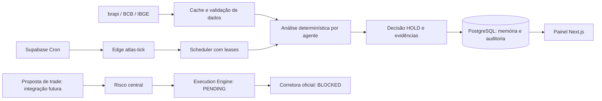

# ATLAS

**Autonomous Trading & Learning Agent System** — plataforma pessoal de análise, agentes por ativo, controles de risco e auditoria para ações à vista B3.

**Estado: implementação local parcial, com execução real bloqueada.** Há fontes reais de leitura, cadastro de ativos/agentes, Supabase Auth/TOTP, scheduler e decisões de observação persistidas. Não há corretora conectada, PIX automático ou ordem real enviada. A estratégia inicial produz **HOLD**, com indicadores e motivos verificáveis. As bibliotecas de risco, OMS e research têm testes; isso não certifica uma integração de corretora.

Comece por [viabilidade](docs/FEASIBILITY.md), [pesquisa de corretoras](docs/BROKER_RESEARCH.md), [custos](COST.md) e [roadmap](docs/ROADMAP.md). Os 37 tópicos do pedido estão na [matriz de requisitos](docs/REQUIREMENTS.md).

## 1. Como as partes se conectam



Um agente é configuração + memória + jobs; não é um processo LLM permanente. O orçamento é um **limite proposto**, e não dinheiro criado. O ledger usa partidas balanceadas e PostgreSQL calcula valores `numeric`. Dinheiro cruza as interfaces financeiras como strings decimais. Nenhum token de broker, banco ou serviço é enviado ao navegador.

## 2. Programas necessários

- Node.js **22.16 ou mais recente**; a entrega foi verificada com Node 24.14.0.
- npm (incluído no Node) e Git.
- Editor de texto, por exemplo VS Code.
- Conta Supabase para Auth/banco e uma hospedagem Next.js para nuvem.
- Docker é opcional para uma instalação Supabase local completa. Os testes do banco já usam PostgreSQL WASM/PGlite, sem Docker.

No PowerShell, confira `node --version`, `npm --version` e `git --version`. Reinicie o terminal após instalar programas.

## 3. Clonar e instalar

Se já está na pasta ATLAS, não clone outra cópia. Para uma instalação nova:

```powershell
git clone https://github.com/BrenoSilveiraLeal/A.T.L.A.S.git
cd A.T.L.A.S
npm ci
Copy-Item .env.example .env.local
```

O repositório remoto pode não conter esta implementação até os commits locais serem enviados. Os comandos e arquivos desta entrega estão na pasta de trabalho atual. Evite executar builds dentro do OneDrive: ele pode transformar arquivos de `.next` em pontos de reanálise e causar `EPERM`. Uma cópia fora de pastas sincronizadas evita esse problema; não mova arquivos de código enquanto houver trabalho em andamento.

## 4. Criar o Supabase exclusivo do ATLAS

1. Entre em [Supabase Dashboard](https://supabase.com/dashboard).
2. Clique **New project**, escolha sua organização, nome `atlas` e região próxima ao Brasil. Confira o plano antes de criar. Não reutilize bancos de outros produtos. O Free tem limite de projetos; consulte [COST.md](COST.md).
3. Guarde a senha do banco em um gerenciador de senhas. Ela não entra no frontend nem no Git.
4. Aguarde o projeto ficar saudável. Em **Connect / API Keys**, copie a URL e a chave publishable para `.env.local`. Copie a chave secret/service role somente para a variável server-side `SUPABASE_SERVICE_ROLE_KEY`.
5. Em **Authentication → Users → Add user → Create new user**, crie apenas seu usuário. Não use convite por e-mail se não deseja enviar uma mensagem.
6. Copie o UUID do usuário para `ATLAS_OWNER_ID`. Em **Authentication → Sign In / Providers**, desative novos cadastros e login anônimo; mantenha login por e-mail/senha.
7. Configure Site URL e redirect URLs para sua origem local e, depois, para a URL HTTPS da hospedagem. Configure expiração curta de JWT (por exemplo, 900 segundos) e reveja as opções de sessão disponíveis no seu plano. Cookies do ATLAS têm limite de uma hora e são renovados pela sessão válida; cookies não substituem revogação no Auth.

Os projetos Insidely existentes não foram alterados. Esta entrega não criou um projeto Supabase remoto.

## 5. Aplicar as migrations e registrar o proprietário

No **SQL Editor** do projeto ATLAS, execute integralmente, nesta ordem:

1. `supabase/migrations/20260913235609_atlas_foundation.sql`
2. `supabase/migrations/20260914045633_atlas_analysis_pipeline.sql`
3. `supabase/migrations/20260914135359_atlas_configuration_audit.sql`
4. `supabase/migrations/20260914230025_atlas_cache_retention.sql`

Depois execute, substituindo o UUID pelo seu usuário real:

```sql
insert into public.system_state(owner_id)
values ('UUID-DO-SEU-USUARIO');
```

`system_state` aceita apenas um proprietário. Os defaults são live desligado e kill switch ativo. Sem esse registro, as RPCs recusam operações. As tabelas têm RLS: leitura exige proprietário e AAL2; gravações financeiras são restritas a RPCs server-side. Use o Security Advisor do Supabase após aplicar.

Alternativa para manutenção com histórico do CLI: consulte `npx supabase --help`, `npx supabase login --help`, `npx supabase link --help` e `npx supabase db push --help`, autentique sua conta, vincule o **projeto ATLAS** e aplique as migrations. Não combine aplicação manual com `db push` sem antes alinhar o histórico de migrations; o SQL Editor não registra esse histórico automaticamente.

## 6. Configurar variáveis

Abra `.env.local` no editor e preencha:

| Variável | Valor / finalidade |
|---|---|
| `SUPABASE_URL` | URL do projeto ATLAS |
| `SUPABASE_PUBLISHABLE_KEY` | Chave pública Supabase, utilizada pelo backend BFF |
| `SUPABASE_SERVICE_ROLE_KEY` | Chave secret/service role; acesso privilegiado somente no servidor |
| `ATLAS_OWNER_ID` | UUID do proprietário registrado em `system_state` |
| `ATLAS_APP_URL` | Local: `http://127.0.0.1:3000`; produção: origem HTTPS exata |
| `BRAPI_API_TOKEN` | Token obtido no painel oficial brapi; necessário para seu universo de ativos |
| `CRON_SECRET` | Segredo aleatório forte, igual no servidor Next e na Edge Function |
| `SESSION_COOKIE_SECURE` | `false` somente para HTTP local; `true` em produção HTTPS |
| `LIVE_TRADING_ENABLED` | Manter `false`; esta versão recusa execução mesmo se alterado |
| `ATLAS_OWNER_PIX_KEY` | Reservada para futura integração; deixe vazia por enquanto |

Não cole secrets no chat, não adicione prefixo `NEXT_PUBLIC_` a credenciais e não publique `.env.local`. Gere `CRON_SECRET` com um gerenciador de senhas. Reinicie o servidor após mudar variáveis.

## 7. Executar e cadastrar TOTP

```powershell
npm run dev
```

Abra **http://127.0.0.1:3000**. Sem configuração, o painel mostra os requisitos e os campos financeiros ficam indisponíveis. Com configuração, o acesso redireciona para `/login`.

Entre com seu e-mail/senha. Clique **Cadastrar autenticador**, adicione uma conta TOTP no aplicativo autenticador e informe a chave exibida somente durante o cadastro. Digite o código atual de seis dígitos. Guarde a recuperação de acesso conforme o procedimento do Supabase e seu gerenciador; não existe bypass local de MFA.

## 8. Criar ativos, agentes e limites

1. Abra **Mercado**. Consulte um ticker e confira origem, horário e status DELAYED/STALE.
2. Em **Cadastrar ativo**, informe ticker, empresa e setor. O cadastro não certifica lote, tick ou elegibilidade de execução.
3. Em **Agentes**, clique **Criar agente**, escolha o ativo, nome, perfil visual, orçamento proposto e intervalo. Os agentes nascem pausados e com caixa zero no ledger, sem depósito fictício.
4. Abra o agente e clique **Ativar análise**. A estratégia disponível é observação SMA20/SMA50; ela registra HOLD e bloqueios de execução. Isso não é uma estratégia de trading homologada.
5. Em **Risco e limites**, registre um perfil completo. Os valores não vêm preenchidos com recomendações de investimento. Salvar o perfil não o torna uma aprovação live nem vincula automaticamente toda a carteira.
6. O scheduler encontra os agentes vencidos, preserva os dados utilizados e grava decisão, memória e auditoria atomicamente. Consulte o detalhe do agente e a auditoria.

Uma falha de fonte coloca o agente em `RISK_BLOCKED`; revise o erro no banco/saúde antes de reativar a análise. O limite brapi é conservador: até 150 consultas lógicas/dia, cada uma com no máximo três tentativas, compartilhadas entre UI e scheduler. Cache: cotação 30min, histórico 12h, notícias 15min e macro 6h. Aumentar polling não remove atraso.

Em **Mercado → Fundamentos · CVM**, informe o código CVM da companhia, o exercício e o escopo consolidado ou individual. O conector lê DFP anual e conserva rubrica, versão, moeda/escala e arquivo de origem. Não deduz código CVM pelo ticker, nem substitui contas ausentes por zero. A consulta não precisa de token CVM; exige o login privado do ATLAS e acesso HTTPS à fonte pública. São permitidas quatro novas consultas à fonte por dia; o resultado normalizado fica em cache por sete dias. O acesso de rede à CVM ainda precisa de validação no ambiente de implantação, conforme [CVM_FUNDAMENTALS.md](docs/CVM_FUNDAMENTALS.md).

A visão geral e a tesouraria leem o último snapshot contábil conciliado. Cada total preserva a data do registro e usa strings decimais; não representa saldo disponível para uma nova ordem. Sem snapshot válido ou com divergência, os totais ficam indisponíveis. Gráficos de evolução da carteira e integração ao saldo da corretora continuam pendentes.

## 9. Validar localmente

```powershell
npm run lint
npm run typecheck
npm test
npm run build
```

Testes incluem risco, OMS, providers, autenticação, payload/CSRF, research e migrations PostgreSQL. Fixtures existem somente em `tests/`. O teste de rede pública é opt-in:

```powershell
$env:ATLAS_PUBLIC_DATA_SMOKE = '1'
npm test -- tests/providers.test.ts -t 'public endpoint smoke'
Remove-Item Env:ATLAS_PUBLIC_DATA_SMOKE
```

Esse smoke consulta dados públicos reais, sem enviar ordem. Ele não comprova SLA, licença profissional, autenticação de broker, sessão de mercado ou qualidade point-in-time de dataset.

## 10. Hospedar o frontend/backend

Vercel é o destino solicitado. Antes de publicar, confira [COST.md](COST.md): a adequação do Hobby a uma aplicação que busca ganho financeiro **não foi presumida**, e seu cron diário não atende este scheduler. Não houve contratação de plano nem deploy remoto nesta entrega.

1. Envie os commits ao seu repositório GitHub quando revisados.
2. No Vercel, clique **Add New → Project**, importe o repositório e selecione Next.js, raiz do projeto, `npm run build` e `npm ci`.
3. Adicione as variáveis server-side na configuração de **Environment Variables**. Use `SESSION_COOKIE_SECURE=true`, origem HTTPS correta e `LIVE_TRADING_ENABLED=false`.
4. Implante e atualize a Site URL do Supabase. Separe projetos/segredos de Preview e Production.
5. Verifique login, MFA, leitura de ativos e um job de análise. Não envie segredos como texto em issues, logs ou descrições de deploy.

Também é possível hospedar o Next em um servidor Node compatível, com HTTPS e reverse proxy, usando `npm run build` e `npm start`. O processo precisa ser supervisionado pela hospedagem. A existência dessa alternativa não comprova hospedagem gratuita contínua.

## 11. Scheduler na nuvem

1. Depois do deploy Next, confira no CLI `npx supabase functions deploy --help` e publique a função `atlas-tick` no projeto ATLAS. O `supabase/config.toml` usa autenticação própria por `CRON_SECRET`; nenhuma chamada anônima sem segredo é aceita.
2. Em **Edge Functions → Secrets**, configure `ATLAS_APP_URL` e `CRON_SECRET` idênticos aos do servidor Next. Não grave secrets no SQL do repositório.
3. Ative **Cron (pg_cron)** e **pg_net** nas integrações do Supabase.
4. Em **Vault**, crie `atlas_tick_url` com a URL HTTPS da função publicada e `atlas_cron_secret` com o segredo correspondente.
5. Execute `supabase/setup-scheduler.sql` no SQL Editor. Ele instala um único cron central a cada minuto. O intervalo de cada agente determina quando analisar; nenhum loop infinito roda em Vercel.
6. Consulte os registros Cron/Edge e `/app/health`. O scheduler processa até três agentes por chamada, usa lease de 120s e grava health com validade de três minutos.
7. Faça uma análise, desligue seu computador e confira depois os registros posteriores ao desligamento. Só esse teste valida o requisito cloud; ainda não foi executado nesta entrega.

O Free pode pausar e não tem SLA de disponibilidade. Antes de live, backup/restore, monitoramento externo e alertas fora do painel precisam ser implementados e testados.

O painel converte medições vencidas, futuras ou inválidas para `UNKNOWN`, preservando o estado que foi originalmente registrado. A cada hora, o scheduler também pode remover até 500 registros de cache com mais de sete dias. Essa limpeza é restrita a `READ_CACHE_V1`: decisões, memória, ordens, ledger e auditoria são preservados. Falha na manutenção degrada a saúde e não cria sucesso fictício.

## 12. Adicionar uma corretora

Leia [BROKER_RESEARCH.md](docs/BROKER_RESEARCH.md). Cedro API Trading, ProfitDLL e Genial MT5 Swing são caminhos condicionais diferentes, não providers prontos.

O adaptador deve implementar `src/core/broker.ts` com documentação oficial, credenciais e capabilities verificadas. Integre então o serviço de execução às transações/reservas no banco, sem permitir que UI ou agente chamem `placeOrder` diretamente. Para timeout, consulte a ordem pelo identificador idempotente; nunca repita envio cegamente. Não substitua essa integração por Selenium, cookies de home broker ou endpoints privados.

Autenticação, conta, sandbox, confirmação/fill e reconciliação do canal escolhido são **PENDING**. Sem esses dados externos não é possível homologar o adaptador nem calcular seu custo total.

## 13. Ativar o sistema e operar com segurança

Ativar **análise** está descrito acima. Ativar **trading real** ainda não está disponível: siga [LIVE_READINESS.md](docs/LIVE_READINESS.md). O botão vermelho persiste bloqueio global e informa que cancelamentos não puderam ser confirmados sem broker. Ele não vende posições. Depósitos/retiradas devem ser feitos no canal oficial; abrir instrução ou QR não credita o ledger.

Consulte [VALIDATION.md](docs/VALIDATION.md) para as evidências desta entrega, [ARCHITECTURE.md](docs/ARCHITECTURE.md) para fronteiras e [ROADMAP.md](docs/ROADMAP.md) para pendências. O objetivo continua execução real oficialmente suportada; nenhum componente pendente é substituído por simulação em produção.
