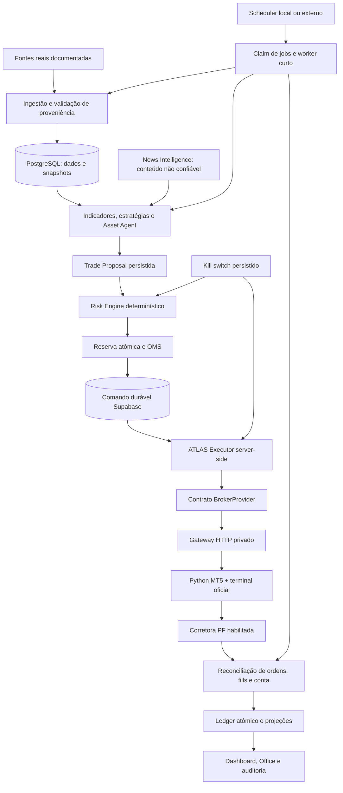

# ATLAS — Arquitetura

Baseline: 2026-09-13; integração de execução atualizada em **2026-09-16**. Implementação e operação são discriminadas no [roadmap](ROADMAP.md). A [matriz](REQUIREMENTS.md) preserva os 37 tópicos originais. A [decisão de gateway](EXECUTION_GATEWAY_DECISION.md) substitui a dependência principal de API direta por ATLAS Executor + plataforma oficial MT5, sem escolher corretora.

## Decisões

| Decisão | Escolha e motivo | Limite explícito |
| --- | --- | --- |
| Estrutura | Monólito modular TypeScript com Next.js App Router: uma aplicação e módulos de domínio puros; separar runtime, providers e UI. Reduz custo operacional e permite extrair worker depois. | Não criar microserviço por personagem; nenhum módulo de UI executa ordens. |
| Web | Next.js, React, TypeScript, CSS/Tailwind; componentes servidor por padrão, componentes cliente apenas para interação/gráficos/office. | Design não comprova funcionamento financeiro. |
| Persistência | Supabase PostgreSQL, migrations e transações RPC para ledger, reservas, jobs e OMS; constraints e RLS. | Requisições REST separadas não formam uma transação. |
| Dinheiro | `numeric(28,10)` inicialmente no banco, decimal.js no domínio, strings decimais no JSON; arredondamento explícito por moeda/instrumento no boundary. | Nunca usar `Number`/float para saldos, preços, taxas, reservas ou P&L contábil; ajustar escala documentadamente se provider exigir. |
| Autenticação | Supabase Auth + TOTP, allowlist do proprietário por UUID server-side, autorização em toda mutação; AAL2 para operações financeiras sensíveis. | Cadastro/fator presente não prova sessão AAL2; segredo de serviço nunca chega ao browser. |
| Background | Instalação atual usa rotina local e jobs Supabase com claim/leases. Migração pode hospedar ATLAS e scheduler em VPS ou usar dispatcher Supabase para backend externo. | Banco remoto sozinho não executa o cérebro ATLAS. Operação com PC desligado ainda não foi validada. |
| Execução | `AtlasExecutor` reutiliza Risk/OMS e persistência durável; `BrokerProvider` delimita gateway HTTP privado. Ponte inicial usa Python MetaTrader5 oficial e terminal. | Nenhuma corretora é fixada no domínio. ProfitDLL e API oficial direta são caminhos futuros; capacidades reais continuam exigidas. |
| IA | Enriquecimento central compartilhado por notícia/evento; schema e limites; estratégia determinística funciona com evidências disponíveis. | Sem chave/provider LLM, marcar AI indisponível; não substituir por texto fingindo análise. |
| Accounting | Ledger de partidas balanceadas, projeções auditáveis e reconciliação periódica; ajuste explícito, nunca editar o passado. | Só broker/banco oficial comprova caixa externo e execução. |
| Animação | Office 2D leve, estados vindos do backend, animação CSS/Motion apenas após fundação operacional. | Personagem não aumenta risco nem cria atividade fictícia. |

O App Router suporta organização por rotas e componentes servidor/cliente. A escolha de um monólito modular é uma decisão do ATLAS, não uma exigência do framework. [Documentação Next.js](https://nextjs.org/docs/app).

Supabase oferece TOTP e níveis de garantia `aal1`/`aal2`, usados para aplicar MFA tanto no servidor quanto nas políticas de acesso. A autorização do proprietário é uma camada adicional do ATLAS. [Supabase MFA](https://supabase.com/docs/guides/auth/auth-mfa).

Supabase Cron executa SQL/funções ou requisições HTTP e registra execuções; a documentação recomenda até oito jobs simultâneos e duração de até dez minutos. ATLAS adota batches menores e limites abaixo do runtime escolhido. [Supabase Cron](https://supabase.com/docs/guides/cron). `pg_cron` + `pg_net` permitem invocação periódica, com credencial de chamada guardada em Vault. A autenticação do endpoint ATLAS usa segredo próprio, não a publishable key como prova de autorização. [Agendamento de funções](https://supabase.com/docs/guides/functions/schedule-functions).

Vercel Hobby permite cron diário com precisão horária e não atende este agendamento intraday. O scheduler atual é local; a arquitetura aceita processo supervisionado em VPS ou dispatcher Supabase para backend externo. Invocações HTTP consomem orçamento de funções e não garantem disponibilidade/latência para trading. [Limites de Cron da Vercel](https://vercel.com/docs/cron-jobs/usage-and-pricing).

## Fluxo e fronteiras de confiança



LLM e notícias não recebem credenciais de broker, ferramentas de execução, privilégios de banco ou autoridade para mudar risco. Conteúdo externo entra como dados delimitados, com schema, tamanho máximo, URLs permitidas e extração de campos; resultado é verificado. Sanitização e prompts ajudam, mas a proteção principal é a ausência de capacidade de executar operações a partir de conteúdo não confiável.

O ATLAS Executor é o único caminho autorizado de escrita no gateway. Usa intenção persistida, decisão de risco válida, reserva confirmada e revalidação do bloqueio global imediatamente antes da chamada. A ponte só executa/reporta; estratégia, decisão e contabilidade ficam no ATLAS. Existe uma janela inevitável entre chamada externa e persistência; o protocolo de reconciliação trata essa incerteza sem afirmar exactly-once na rede. Kill switch não promete desfazer uma ordem já aceita pela corretora.

## Organização planejada

```text
src/app/                    rotas, handlers e composição Next.js
src/components/             componentes de apresentação ATLAS
src/domain/                 dinheiro, decisões, risco, OMS, ledger e estratégias puros
src/server/                 auth, configuração, serviços, orquestração e repositories
src/providers/              adapters oficiais de mercado, macro, news, broker e funding
supabase/migrations/        schema, constraints, RLS, funções atômicas e jobs
tests/                      fixtures e doubles permitidos somente aqui
docs/                       viabilidade, requisitos, arquitetura, roadmap e operação
gateways/mt5/               ponte Python oficial + terminal, sem estratégia
```

É um destino arquitetural; diretórios existentes e entregas reais devem ser consultados no repositório. Não são necessários pacotes separados antes de haver reutilização real. Fixar versões no lockfile e validar a compatibilidade da versão instalada antes de implementar cada integração.

## Módulos e contratos

| Módulo | Entrada e responsabilidade | Saída persistida |
| --- | --- | --- |
| Market Data | Providers reais; ticker lookup; quotes/OHLCV; timestamp, atraso, licença e corporate actions. | Observações com proveniência, cache, freshness e versão. |
| Technical | Séries válidas, indicadores plugáveis e fórmulas determinísticas. | Indicadores e requisitos mínimos de janela. |
| Fundamental / Macro | CVM, BCB, IBGE e outras fontes oficiais; períodos e instante de publicação. | Séries normalizadas, revisões e proveniência point-in-time. |
| News Intelligence | URLs e fontes permitidas, deduplicação por evento, entidades, relevância, sentimento, impacto. | Notícias/eventos e análise compartilhada; sem notícia inventada. |
| Asset Agent | Snapshots de mercado, análise técnica/fundamental/news/macro, carteira, risco e estratégia versionada. | Proposta ou HOLD com justificativa resumida, fontes, horários e invalidações. |
| Supervisor / Meeting | Exposições, correlações, alertas e eventos materiais; reutilizar análises dos agentes. | Reuniões e recomendações; pausas autorizadas; redistribuição proposta. |
| Risk | Estado completo da carteira, ordens/reservas, limites, sessão, dados, capabilities e proposta. | Aprovação/rejeição com motivos, versão dos limites e expiração. |
| Execution / OMS | Apenas aprovação válida com reserva, idempotency key e capabilities compatíveis. | Transições de ordem, eventos externos e status de reconciliação. |
| Treasury | Caixa oficial, capital comprometido, alocações e movimentos confirmados. | Ledger, snapshots reconciliados e solicitações de funding. |
| Scheduler / Health | Agentes vencidos, jobs de ingestão/conciliação e orçamento de providers. | Jobs, leases, tentativas, heartbeat, alertas e correlation IDs. |

`BrokerProvider` expõe `connect`, `healthCheck`, `getAccount`, `getCash`, `getPositions`, `getOrders`, `getOrder`, `getOrderByClientId`, `placeOrder`, `modifyOrder`, `cancelOrder` e `getExecutions`. Cada capability informa suporte real a tipo de ordem, identificação do cliente, consulta e reconciliação; lote/tick, ambiente, sessão e permissões também precisam ser verificados. Operação sem suporte retorna erro explícito; nunca sucesso fabricado. Se não houver consulta confiável por identidade da ordem após timeout, a submissão autônoma fica bloqueada.

O adaptador MT5 inicial limita escrita a LIMIT/DAY, cancelamento e alteração de preço com quantidade preservada. A interface comum permite evolução, mas não amplia automaticamente as capacidades da ponte. `getCash` não transforma margem livre/balance MT5 em caixa liquidado: quando esse dado não é demonstrável, retorna indisponibilidade e a reconciliação completa permanece falsa. Taxas totais desconhecidas também impedem contabilidade final fabricada.

`FundingProvider` separa criar instrução de depósito, consultar confirmação e solicitar/consultar retirada. PIX manual pode registrar instrução ou solicitação; só uma reconciliação independente promove para confirmado. `ATLAS_OWNER_PIX_KEY` é exclusivamente secret server-side e não faz parte de seed, fixture real, banco público ou log.

## Persistência e invariantes

Entidades planejadas: `users` (perfil ligado a `auth.users`), `agents`, `assets`, `agent_allocations`, `broker_accounts`, `broker_connections`, `portfolio_snapshots`, `positions`, `orders`, `order_events`, `executions`, `trade_proposals`, `decisions`, `strategies`, `strategy_versions`, `risk_profiles`, `market_data_cache`, `news_articles`, `news_asset_links`, `agent_memories`, `ledger_transactions`, `ledger_entries`, `treasury_transactions`, `meetings`, `meeting_participants`, `alerts`, `audit_logs`, `system_health`, `jobs`, `job_runs`, `market_sessions` e `corporate_actions`.

- Identidades UUID internas e IDs externos separados; unicidade composta por provider/conta/ID externo para ordens, execuções, movimentos e eventos; FKs e ownership consistente.
- `timestamptz` em UTC; sessão de negociação calculada por `America/Sao_Paulo` e calendário oficial versionado, nunca por offset fixo ou apenas segunda–sexta.
- Valores `numeric` com checks de finitude, sinal e escala; quantidades respeitam instrumento/lote; moeda explicitada; câmbio não inferido. Taxas podem permanecer desconhecidas até confirmação, impedindo P&L final fabricado.
- Ledger balanceado dentro de uma RPC/transação, entradas imutáveis; reservas, alocações e saldo lidos e modificados com locks no mesmo boundary; sem depender de lock em memória de função serverless.
- Preferir funções invoker. Funções privilegiadas necessárias devem ter `search_path` fixo, schema não exposto quando possível, grants mínimos, checagem explícita do chamador e `EXECUTE` revogado de `PUBLIC`, `anon` e demais papéis não autorizados. RLS em todos os schemas expostos; views respeitam privilégios/RLS.
- Repositories não permitem browser inserir fills, ledger, aprovação de risco ou flags de live. Service key restrita ao backend não substitui checagem de owner/AAL2 nas rotas.
- Auditoria liga snapshot → decisão → proposta → aprovação → ordem → fill → ledger por correlation ID; registros redigidos preservam campos auditáveis sem credenciais, PIX ou conteúdo secreto.

## Protocolo de jobs, risco e ordem

1. Cron encontra `next_analysis_at <= now()` e jobs de ingestão/conciliação devidos; uma chave única de janela/evento evita duplicação. Batch e concorrência são limitados por orçamento dos providers.
2. RPC faz claim com lock e lease. Reinício do worker recupera trabalho elegível; lease expirada de uma submissão ambígua exige reconciliar, não reenviar.
3. Carregar snapshots e confirmar origem, freshness, sessão, instrumentos e versão da estratégia. Persistir decisão/proposta antes de qualquer efeito externo.
4. Risk Engine valida limites e carteira completa. RPC reserva caixa/quantidade com invariantes e versão; concorrência entre agentes não pode passar separadamente com o mesmo caixa.
5. Persistir intenção `SUBMITTING` e client order ID antes da chamada externa. Só o adapter comprovado envia a ordem. Resultado confirmado produz `SUBMITTED` ou `REJECTED`; timeout deixa `reconciliationRequired=true`.
6. Consultar ordens/execuções no broker, com retries de leitura e backoff. Reenvio somente após prova documentada de ausência e sem contradizer idempotência suportada pelo broker; quando não é possível provar, manter bloqueio e alerta.
7. Ingerir fills idempotentemente em transação; atualizar reserva restante, posição e ledger. Cancelamento solicitado não libera reserva até confirmação ou execução conciliada.
8. Reconciliar caixa, posições, ordens e taxas periodicamente e após eventos críticos. Divergência gera circuit breaker; correção exige registro explícito e origem.

Estados OMS previstos são os do R08. Incerteza de envio é atributo adicional persistido, não um terminal `ERROR` que permita repetir. Todas as transições têm causa, horário, ator e versão; transições inválidas são rejeitadas. Modificação de ordem exige revalidação de risco/reserva e semântica oficial de alteração/cancel-replace.

## Segurança, dados e degradação

Sem configuração externa a aplicação mostra `UNCONFIGURED`/`PENDING`, sem saldos, posições, ordens ou notícias fictícios. Faltando credencial LLM, broker, market feed ou calendário, o módulo relevante fica indisponível; a estratégia que depende dele não roda em live.

Auth usa sessão validada no servidor e owner UUID definido em ambiente; verificar AAL2 para ativação live, alteração de risco/credenciais e movimentações financeiras. Cookies devem ser `Secure` em produção e ter `SameSite` apropriado; tokens privilegiados ficam em cookies HttpOnly/server storage conforme o fluxo escolhido. Mutação baseada em cookie verifica origem e proteção CSRF aplicável. Não inferir autorização de metadados editáveis pelo usuário. Revogação e expiração precisam ser verificadas nas operações sensíveis.

Jobs usam segredo rotacionável server-to-server; preview não executa trading de produção. APIs usam schema estrito, limites de payload, rate limiting persistido e redaction. Fetch de notícias aceita somente fontes/hosts autorizados e bloqueia rede privada/redirecionamento perigoso. Não fazer scraping de home broker, engenharia reversa, reuso de cookie ou bypass de MFA.

`LIVE_TRADING_ENABLED=false` é defesa inicial, não gate único. A habilitação exige capacidades do provider e aprovação técnica persistida, configuração de todos os limites, MFA, integração validada, reconciliação saudável, dados elegíveis, calendário e kill switch desativado por ação autorizada. Readiness é reavaliada a cada submissão, não apenas no login.

Falhas de risco, DB, broker, sessão, sincronização ou dados interrompem novas ordens. Falha de notícias/IA pode degradar somente estratégias que explicitamente não dependem desses módulos e continuam aprovadas; não se interpreta erro como opinião neutra. Health inclui última checagem e validade; GREEN antigo expira.

## Evolução e pendências

Implementar primeiro contratos, limites e contabilidade, depois conectores comprovados e execução, e por fim office. Não escolher estratégias intraday antes de provar licenciamento/atraso e não forçar runtime serverless em provider que exija sessão persistente, FIX, IP fixo ou gateway desktop. Se esse for o único caminho oficial viável, registrar nova decisão arquitetural e custo antes de contratar infraestrutura.

Supabase, proprietário, senha e TOTP estão configurados na instalação atual. Continuam PENDING: hospedagem externa, scheduler cloud, módulos ainda parciais, conta de corretagem/terminal, dados elegíveis de execução, funding automático, homologação real e fluxo R37. A configuração do banco não remove esses limites.

## Estado implementado em 14/09/2026

Registro histórico: monólito modular em `src/core` (risco/OMS/research/análise), `src/providers` (HTTP real), `src/lib` (Auth BFF/cache/scheduler), `src/app` e `src/components`. Quatro migrations naquele momento e testes PostgreSQL locais. A observação SMA gera somente HOLD; `finish_agent_analysis` grava evidências e conclui job com fencing na mesma transação. Naquela etapa `BrokerProvider` ainda não tinha adapter. Auth usa cookies HttpOnly server-side, `getUser` + `getClaims`, owner UUID e AAL2. A UI não recebe chaves de serviço.

### Continuação em 15/09/2026

O cache de leitura usa upsert da chave única; evidências de análises são cópias persistidas fora dele. A RPC `prune_market_data_cache` valida proprietário, limita o lote e remove somente cache de leitura vencido há sete dias. O scheduler limita a tentativa de manutenção a uma vez por hora; falha degrada saúde. A API normaliza a validade de health no momento da leitura, sem reescrever a evidência original.

A consulta CVM é explícita por código, ano e escopo e não é executada em cada job de agente. Ela baixa um ZIP anual do host oficial fixo, processa apenas índice/BPA/BPP/DRE necessários e retém versão, rubricas e SHA-256. Downloads/CSV/descompressão têm limites e não há extração de arquivos em disco. Sem comprovação da data de publicação, `pointInTimeEligible` e `executionEligible` continuam falsos. ITR, EBITDA, múltiplos e integração de fundamentos às estratégias permanecem pendentes.

A visão geral e a tesouraria consomem `get_accounting_snapshot` em strings decimais. Totais exigem snapshot conciliado sem divergências e exibem a data de origem. São valores históricos; o motor de risco deve obter reconciliação elegível antes de autorizar uso de caixa. Valores ausentes nunca se tornam zero automaticamente.

### Reorientação em 16/09/2026

Executor e gateway foram separados da escolha da corretora. A migration `20260916045026_atlas_executor_gateway.sql` adiciona persistência de comandos, claims, estado contábil e fills, reutilizando os registros de decisão, risco, ordem, ledger e auditoria existentes. O runtime autenticado `/api/executor` permite monitoramento e trabalho limitado; configuração de ambiente não substitui aprovação e estado do banco.

O claim durável é gravado antes da chamada. Comando despachado/ambíguo nunca volta a PENDING automaticamente. ACK e ledger usam controle de versão; fill confirmado é deduplicado e aplicado transacionalmente. A ponte MT5 tem journal SQLite local antes do `order_send`, verifica conta/símbolo e usa consultas oficiais para recuperação. Nenhuma consulta inconclusiva permite reenvio cego.

A topologia externa candidata é Windows VPS com ATLAS/backend, scheduler, gateway Python e terminal, conectada ao Supabase. MetaQuotes Virtual Hosting aceita EA/WebRequest, mas não essa ponte Python/Node; o EA permanece alternativa pesquisada. Não houve contratação nem migração da operação local.

Estratégias existentes continuam observação/HOLD. A conta real, a semântica de caixa liquidado/taxas, feed/sessão, propostas operacionais e homologação ponta a ponta permanecem gates explícitos. Detalhes em [EXECUTION_GATEWAY_DECISION.md](EXECUTION_GATEWAY_DECISION.md).
