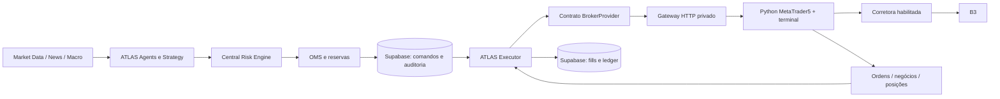

# Decisão de integração: ATLAS Executor e gateway MT5

Data: **16/09/2026**. Esta decisão preserva agentes, estratégias, Central Risk Engine, OMS, Treasury, ledger, auditoria, scheduler e Supabase. A pesquisa usa fontes oficiais atuais em [MT5](research/MT5_GATEWAY_RESEARCH.md) e [ProfitDLL/infraestrutura](research/PROFIT_INFRA_RESEARCH.md). Nenhuma corretora foi escolhida, conta aberta, assinatura comprada ou ordem enviada.

## Conclusão técnica

O caminho principal passa a ser **um gateway MT5 usando o SDK Python oficial e um terminal autenticado**. A API privada de uma corretora deixa de ser pré-requisito arquitetural. A implementação pode avançar sem uma conta de corretagem; a homologação real continua dependente da conta, dos ativos habilitados e das condições da plataforma. O SDK comunica-se com o terminal, que se conecta à corretora: ele não substitui a conta e não é uma API REST da corretora. [SDK oficial MetaTrader5](https://www.mql5.com/en/docs/python_metatrader5).

Um EA MQL5 com `WebRequest` também é uma alternativa oficial viável. Nesta etapa, a ponte Python foi escolhida para manter um diário durável, permitir testes de recuperação e executar separadamente da estratégia. O EA foi pesquisado, mas não implementado. ProfitDLL e futura API oficial direta usam a mesma fronteira de adaptação; não são conectores funcionais entregues por esta mudança.

A plataforma recebe uma ordem já aprovada e reporta seu resultado. **Nenhuma estratégia, decisão de compra/venda, notícia, alocação ou limite de risco migra para o terminal.** A ponte valida identidade, integridade, permissões e condições técnicas do símbolo; esses controles adicionais não lhe dão autoridade para criar ordens.

## Implementação e fronteiras

| Camada | Responsabilidade | Evidência / limite |
| --- | --- | --- |
| `src/core/broker.ts` | Contrato comum de conta, caixa, ordens, posições, execuções e capacidades | Não contém escolha de corretora. Capacidades desconhecidas impedem live. |
| `src/core/executor.ts` | Claim durável, revalidação, submissão única, recuperação por leitura, ACK, fills e reconciliação | Reutiliza Risk e OMS existentes. ACK não movimenta caixa nem inventa fill. |
| `src/providers/execution-gateway.ts` | Protocolo HTTP privado, autenticação por segredo, schemas estritos, conta/provider esperados, timeout e limite de resposta | Transporte genérico para MT5; ProfitDLL/API direta podem implementar o mesmo contrato. |
| Persistência Supabase | Fila e comando imutáveis, reserva, claim/CAS, deduplicação de fills, ledger e auditoria em transações | Uma intenção despachada não volta a PENDING após crash ou timeout. |
| Ponte MT5 Python | Terminal oficial, consultas e comandos técnicos; journal SQLite antes do efeito externo | Sem lógica de estratégia; ligação real ainda não homologada. |

O primeiro adaptador restringe escrita a **ordens LIMIT com validade DAY**, cancelamento e modificação de preço mantendo a quantidade. STOP, STOP_LIMIT, MARKET, alteração de quantidade e outras validades não são anunciados como suporte inicial. Uma capacidade mais ampla no contrato TypeScript não habilita automaticamente o adaptador.

O runtime de agentes existente continua de **observação, produzindo HOLD**. Esta mudança não transforma SMA20/SMA50 em estratégia operacional aprovada nem cria propostas BUY/SELL arbitrárias para testar a integração. A entrada de comandos financeiros é server-side e depende de aprovação, reserva e evidência confiável; não é uma API pública para ordens livres.

### Idempotência e incerteza

1. Persistir comando, aprovação e reserva antes de despachar; unicidade por provider/conta/chave e claim atômico impedem dois workers de enviar o mesmo comando.
2. Registrar no journal da ponte a identidade e os termos antes de chamar `order_send`. Uma chave repetida com conteúdo diferente é conflito.
3. Guardar tickets externos como strings. O retorno de `order_send` comprova somente o que seu código de retorno informa; aceite não é execução. [Envio oficial](https://www.mql5.com/en/docs/python_metatrader5/mt5ordersend_py).
4. Timeout, crash ou resposta inválida deixam resultado **UNKNOWN**. A recuperação consulta ordens/histórico; ausência em uma consulta não prova que a ordem nunca existiu. `magic`/comentário auxiliam correlação, mas não são uma chave idempotente garantida pelo servidor.
5. Persistir fills por identidade externa e aplicar ledger/reserva/posição atomicamente. Duplicata idêntica não repete efeito; conteúdo divergente exige reconciliação. Eventos fora de ordem e parcial antes do cancelamento continuam contabilizados.
6. Manter reservas enquanto houver execução não conciliada ou resultado ambíguo. O kill switch impede novos envios; uma solicitação de cancelamento não comprova cancelamento nem desfaz negócios realizados.

Não é prometida execução exatamente uma vez através de falhas de rede. A garantia implementável é deduplicação local durável e ausência de reenvio cego, com bloqueio quando o resultado externo não puder ser provado.

### Caixa, taxas e reconciliação

MT5 fornece `balance`, `equity`, margem e margem livre, mas isso **não prova caixa liquidado, sacável ou custódia integral da corretora**. A ponte não converte margem livre em caixa do Treasury e não preenche campos desconhecidos com zero. [Propriedades da conta](https://www.mql5.com/en/docs/constants/environment_state/accountinformation).

Comissões/taxas presentes no negócio MT5 também não comprovam o custo total final da operação na B3. Caixa liquidado e taxas totais precisam de uma fonte oficial reconciliável antes de liberar a cadeia financeira. A capacidade `completeAccountReconciliation` permanece falsa enquanto essa prova faltar; não há flag que transforme esses campos em evidência. A implementação inicial pode ler dados disponíveis, mas **não passa os gates de execução real** nessas condições.

Netting agrega posições por símbolo. A atribuição entre agentes continua no ledger ATLAS por fill; o terminal não cria uma posição separada para cada agente. Operações manuais e por outras plataformas precisam entrar na reconciliação.

## Comparação e escolha futura da corretora

| Opção | Evidência pública útil | Dependência antes de escolher |
| --- | --- | --- |
| Genial MT5 Swing | Documentação explícita de EA próprio, Netting, overnight e licença R$0 | Confirmar Python externo, ações/lotes/fracionário, leitura de custódia/caixa e taxas do canal. A modalidade Swing não oferece demo. |
| XP MT5 | Plataforma gratuita e criação de robôs anunciadas | Confirmar matriz ações à vista/overnight/Python e tarifa aplicável; corretagem varia por canal e relacionamento. |
| Rico MT5 | Plataforma sem mensalidade e automação anunciadas; corretagem/custódia zero nas condições publicadas | Confirmar escopo do servidor MT5 e aplicação das condições ao gateway próprio. |
| Clear MT5 | MT5 real gratuito e robôs MQL5 anunciados; demo publicada R$9,90/mês + impostos | Oferta MT5 é identificada como day trade; overnight ainda não comprovado. |
| ProfitDLL | Roteamento Bovespa programático e público PF avançado na oferta Nelogica | Cotação, licença de roteamento e habilitação DLL da conta. Profit desktop gratuito não inclui automaticamente DLL. |

Fontes, corretagem, custódia, volume mínimo e ressalvas por corretora estão nas tabelas de [MT5](research/MT5_GATEWAY_RESEARCH.md) e [ProfitDLL](research/PROFIT_INFRA_RESEARCH.md). Genial tem a evidência pública mais explícita para o perfil Swing entre as fontes consultadas; isso **não é seleção de corretora nem certificação da ponte Python nessa conta**. BTG, Toro e outras parceiras Profit não viram candidatas DLL homologadas apenas por oferecer a plataforma desktop.

Tryd Scripts é alternativa oficial a acompanhar. SmarttBot tem documentação histórica de API/sinais, mas não foi comprovada uma API atual completa de custódia/execução de ações à vista adequada ao ATLAS. Cedro/API direta permanece opção futura; não condiciona a implementação atual.

## Operação com o computador pessoal desligado

A topologia prioritária de implantação é **Windows VPS de uso geral com terminal MT5, ponte Python, ATLAS/backend e scheduler supervisionados**, além do Supabase remoto já existente. Uma implantação separando backend e gateway também é possível, usando canal privado autenticado. Em ambos os casos precisam ficar online: cérebro ATLAS, scheduler, Executor, terminal/gateway, banco e fontes essenciais. O navegador pessoal pode ficar fechado.

O Virtual Hosting MetaQuotes, publicado a **US$15/mês**, hospeda EA e permite `WebRequest`, mas proíbe DLLs e não oferece ambiente geral Python/Node. Assim, não hospeda a ponte Python escolhida; seria opção para um futuro EA com backend hospedado separadamente. [Preços](https://www.mql5.com/en/vps/forex-plans), [restrições oficiais](https://www.metatrader5.com/en/terminal/help/virtual_hosting/virtual_hosting_migration).

Referências Windows verificadas: Lightsail + IPv4 a **US$9,50/mês com 0,5GB**, **US$22 com 2GB**, **US$44 com 4GB** ou **US$74 com 8GB**. A menor linha de catálogo não é dimensionamento adequado comprovado. 4GB é ponto inicial de avaliação do MT5/ponte/serviços leves, sujeito a medições; Profit desktop publica mínimo de 8GB, distinto da DLL isolada. Região, impostos, câmbio e excedentes alteram o custo. [Planos oficiais AWS](https://docs.aws.amazon.com/lightsail/latest/userguide/amazon-lightsail-bundles.html), [requisitos Profit](https://www.nelogica.com.br/download).

Genial Cloud publica template MT5 a **R$41,40 sem isenção**, mas não comprova permissão para instalar todos os processos da topologia. Isenção exige RLP e operação de minicontrato; não é gratuidade para uma carteira exclusivamente de ações. Não operar futuros para obter desconto. As condições completas e fontes estão na [pesquisa MT5](research/MT5_GATEWAY_RESEARCH.md).

**Não foi comprovada infraestrutura Windows permanente, gratuita e adequada ao fluxo inteiro.** Créditos AWS e oferta Azure são temporários/condicionados; OCI Always Free não comprova Windows x64 gratuito. Não há serviço contratado. O estado atual permanece **local + Supabase Free**, dependente do PC ligado. A decisão técnica prepara a migração; só teste de operação após desligar o PC comprova esse requisito.

## Ações externas restantes, na ordem

1. Escolher e abrir uma conta PF com ações à vista B3; confirmar modalidade overnight/Netting quando necessária, plataforma oficial e permissão do SDK Python próprio. Confirmar custos, ativos, lotes, ordens e fonte de caixa/posição/taxas.
2. Autenticar o terminal oficial no ambiente próprio. Login e credenciais não devem ir para o chat, repositório ou logs.
3. Autorizar orçamento e contratar VPS compatível para os componentes que precisam ficar online. Nenhuma compra foi realizada nesta etapa.
4. Homologar primeiro conexão e leituras. Validar reconexão, reinício, conta errada, cotação vencida, rejeição, parcial, timeout, alteração, cancelamento e reconciliação. Usar demo oficial quando existir; demo de modalidade diferente não homologa Swing.
5. Qualquer teste com ordem real exige parâmetros e autorização específicos do proprietário, além dos gates de [LIVE_READINESS.md](LIVE_READINESS.md). Não enviar uma ordem apenas para produzir evidência de conclusão.

Esses pontos limitam a homologação externa. Eles não impedem desenvolver e testar os contratos, a persistência, o protocolo, a ponte, o bloqueio de falhas e a documentação. A entrega não é anunciada como produção, 100% funcional ou sistema de trading real já habilitado.
